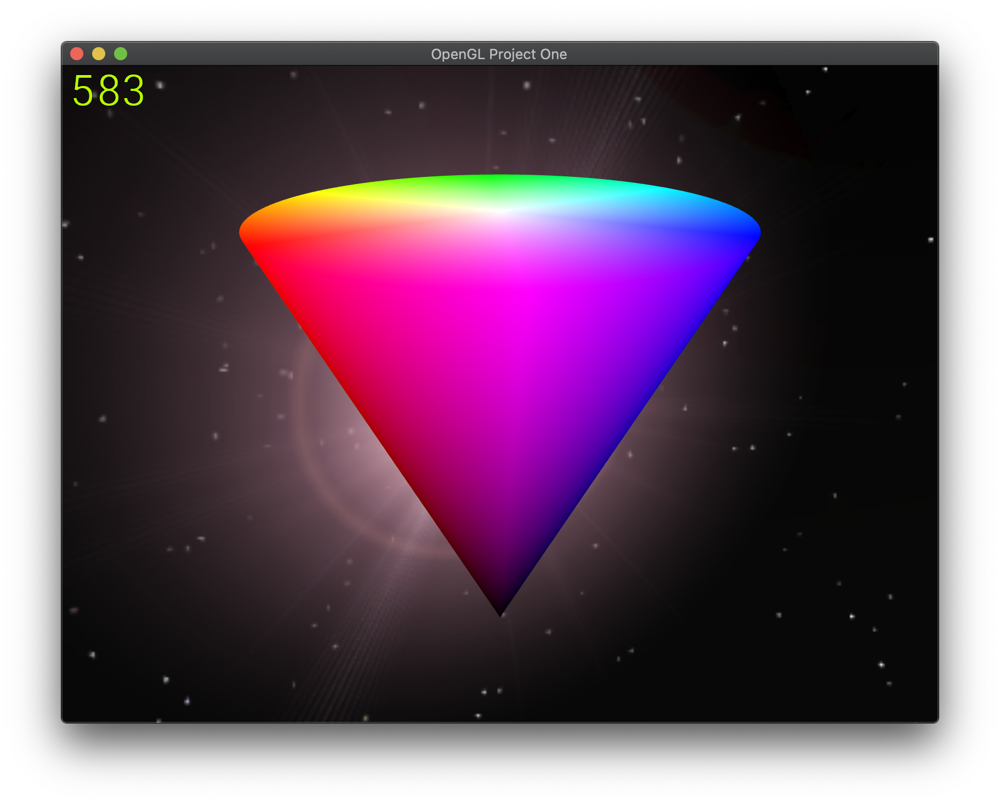

# Вращающийся цветовой конус в OpenGl

Для использования данного кода необходимо его клонировать, поскольку библиотеки подключены через
`git submodule`, а значит простое скачивание архива с Github даст код без библиотек, в результате чего он не
будет собираться. Клонировать проект можно через командрую строку командой
```
git clone --recursive https://github.com/vadimpiven/opengl_proj1
```
или, если используется Visual Studio 2019 - достаточно вставить ссылку на этот репозиторий в пункте
"клонировать" на экране приветствия
([подробная инструкция](https://docs.microsoft.com/ru-ru/visualstudio/get-started/tutorial-open-project-from-repo?view=vs-2019)).
Не спешите с запуском кода - он будет скачиваться несколько минут, сначала код самого проекта, потом код всех зависимостей,
затем Visual Studio будет индексировать все файлы и устанавливать цели сборки. Это может занять от 5 до 10 минут в зависимости
от скорости интернета и мощности компьютера. Если запустить сборку раньше времени - она завершится неудачей.

ВНИМАНИЕ! В списке целей сборки необходимо выбрать `openjl_proj1` для Unix/MacOS или `openjl_proj1.exe` для Windows.

Для перемещения камеры по 3D сцене используйте клавиши `W,A,S,D`, `Space` чтобы подняться, `Left Shift` чтобы опуститься.
Чтобы повернуть камеру в сторону необходимо зажать левую кнопку мыши над окном программы и перетащить курсор в сторону,
когда правая кнопка мыши будет отпущена - поворот камеры завершится. Для закрытия программы можно использовать `Escape`.

## Источники
Проект в основном разрабатывался на основе уроков, приведённых в [данной серии статей](https://habr.com/ru/post/310790/).
Проект в основном находится в рамках уроков 1.1-1.9 за некоторыми исключениями. Для понимания происходящего
настоятельно рекоммендуется изучить хотя бы уроки 1.1 (общие сведения об OpenGL) и 1.4 (отрисовка одного полигона).

## Общая структура
OpenGL является открытым стандартом, описывающим функциональность, которую должны предоставлять видеоадаптеры.
Поэтому OpenGL это не какая-то единая кроссплатформенная библиотека, о множество отдельных реализаций,
вшитых в драйверы видеоадаптеров их производителем. Его единственная задача - вычислять цвет пикселей двумерного буфера.
Таким образом, для работы с OpenGL требуется несколько дополнительных библиотек:
- требуется средствами операционной системы создавать окно программы, в котором далее будет отрисовываться буфер с вычисленными OpenGl цветами,
в данной реализации для этих целей используется библиотека GLFW
- требуется запросить разрешение на использование определённого функционала OpenGL и получить адреса функций в драйвере видеоадаптера,
в данной реализации для этих целей используется библиотека GLEW
- для удобства работы с OpenGL используется библиотека GLM, позволяющая строить матрицы, которые затем передаются
в память видеокарты и используются для вычисления точного цвета пикселей в соответствии с построенной 3D сценой
- для использования текстур используется библиотека STB, позволяющая считывать с диска изображения распространённых форматов
- для загрузки 3D моделей в формате `.obj` к проекту подключена, но не использована, библиотека TinyObjLoader
Все библиотеки подключены статически для избежания проблем с переносимостью проекта.

## Cmake
Для сборки данного проекта используется система сборки Cmake. Она позволяет сделать процесс сборки платформонезависимым.

### Используемые команды Cmake
- `cmake_minimum_required(VERSION 3.8)` - устанавливает минимальную версию Cmake, необходимую для сборки данного проекта.
Значение 3.8 используется, поскольку соответствует версии Cmake, поставляемой в комплекте с Visual Studio 2019.
- `project(opengl C CXX)` - устанавливает имя проекта (далее его можно получить как значение переменной `${PROJECT_NAME}`
или `${CMAKE_PROJECT_NAME}`, если речь идёт о переменной project, заданной в корневой дирректории проекта),
а также используемые в нём языки (что позволяет принудительно подключить необходимые компиляторы), в данном проекте
автоматически выставляется только значение CXX, но поскольку некоторые статически подключаемые библиотеки написаны на C,
требуется вручную указать и его
- `add_subdirectory(proj1)` - позволяет добавить в список сборки цели (targets), определённые в проекте Cmake, расположенном в указанной папке
- `set(CMAKE_CXX_STANDARD 17)` принудительно устанавливает используемый стандарт C++
- `file(GLOB SHADERS shaders/*.vert shaders/*.frag)` - записывает в переменную `${SHADERS}` имена всех файлов, удовлетворяющих 
регулярному выражению `shaders/*.vert shaders/*.frag`
- `add_custom_target("${PROJECT_NAME}_shaders"
          COMMAND embed_shaders "${SHADERS}"
          BYPRODUCTS Shader.hpp
          WORKING_DIRECTORY "${PROJECT_SOURCE_DIR}"
          COMMENT "Generating embeded shaders"
          VERBATIM)` - создаёт новую цель сборки с именем `${PROJECT_NAME}_shaders`, выполняющую команду `embed_shaders "${SHADERS}"`
(в данном случае `embeded_shaders` является именем другого проекта Cmake, расположенным в папке `embeded`, поскольку Cmake видит это,
имя `embed_shaders` будет автоматически заменено на имя исполняемого файла, который получится в результате сборки этого проекта,
т.е. просто `embed_shaders` с случае Linux или MacOS или `embed_shaders.exe` в случае Windows), в результате которой будет
изменено содержимое файла `Shader.hpp`, при этом команду требуется выполнять из рабочей дирректории `"${PROJECT_SOURCE_DIR}"`
(значение этой переменной соответствует пути к данному `CMakeList.txt`, т.е. в случае `proj1/CMakeList.txt` в переменную
`${PROJECT_SOURCE_DIR}` будет записано значение `proj1`), `"Generating embeded shaders"` - сообщение, выводимое в процессе сборки
проекта и сигнализирующее о том, что сборка данной цели выполнена успешно, `VERBATIM` указывает, что значения переменных Cmake,
передаваемых на вход команде должны быть экранированы, т.е. в данном случае в команде `embed_shaders "${SHADERS}"` имена файлов в
переменной `${SHADERS}` будут заключены в двойные кавычки, что позволяет избежать проблем в случае, если пути к файлам будут содержать пробелы
- `if(MSVC) ... endif(MSVC)` - заключённый в этом блоке код будет выполнен только при компиляции с помощью Misrosoft Visual C++ compiler
- `set(CMAKE_EXE_LINKER_FLAGS "${CMAKE_EXE_LINKER_FLAGS} /entry:mainCRTStartup")` - сообщает линковщику Visual Studio, что
точка входа в программы - это функция `main()`
- `add_executable("${PROJECT_NAME}" WIN32 "${SOURCES}")` - добавляет цель (target), с именем `${PROJECT_NAME}`, которая будет
собрана из файлов, перечисленных в значении переменной `${SOURCES}`, значение `WIN32` указывает, что в случае сборки проекта
на платформе Windows приложение должно быть оконным, а не консольным, проблема в данном случае в том, что оконные приложения в 
Windows имеют точку входа `WinMain()`, а нам требуется установить точку входа `main()`, что и делает предыдущая команда
- `add_dependencies("${PROJECT_NAME}" "${PROJECT_NAME}_shaders")` - сообщает, что цель с именем `"${PROJECT_NAME}"` требует
перед выполнением сборки цели с именем `"${PROJECT_NAME}_shaders"` (необходимо только для целей `add_custom_target`, т.к. по умолчанию
они не собираются, если от них никто не зависит)
- `target_include_directories("${PROJECT_NAME}" PRIVATE ../tinyobjloader)` - устанавливает что внутри проекта с именем `"${PROJECT_NAME}"`
и только внутри него (т.к. указан модификатор `PRIVATE`) будуд доступны зоголовочные файлы из папки `../tinyobjloader`, что необходимо
для вызова функций библиотек, определённых в этих заголовочных файлах
- `target_link_libraries("${PROJECT_NAME}" tinyobjloader)` - вызывает линковку цели `"${PROJECT_NAME}"` с библиотекой `tinyobjloader`
(статической или динамической, расширение файла и префикс `lib` в имени указывать не нужно, cmake определит корректное имя автоматически)
подулючённой ранее статически с помощью `add_subdirectory(../tinyobjloader)` или другим путём
- `set(...)` устанавливает значения переменных и настроечных параметров (в данном случае все переменные настроены так, что
компилируется только необходимый минимум - статическая библиотека, все тесты, бенчмарки, динамические библиотеки и т.д. отключены)
- `file(COPY "resources/" DESTINATION "${PROJECT_BINARY_DIR}")` - копирует все файлы из папки `resources/` в папку 
`${PROJECT_BINARY_DIR}` (данная переменная хранит полный путь к папке, куда будет помещён готовый исполняемый файл)

### Общая идея
- в начале запускается программа `embed`, генерирующая на основе файлов в папке `shaders` зоголовочный файл
`Shader.hpp` (при изменении класса `Shader` будьте внимательны - не забудьте обновить исходный код `embed`), сожержащий
строковые константы вида `FRAG_FILE` для файлов вида `shaders/file.frag` (это сделано для того, чтобы можно было удобно
радактировать шейдеры в отдельном файле и использовать подсветку синтаксиса, которую реализуют дополнения для Visual Studio 
и других IDE)
- затем выполняется компиляция самой программы `proj1`, а также всех библиотек
- к `proj1` статичиски линкуются все библиотеки
- ресурсы из папки `resources` копируются в папку со свежескомпилированной программой (ВНИМАНИЕ! если папка resources
отсутствует - программа не будет успешно компилироваться), в результате чего в коде программы можно обращаться к ресурсам
не указывая полный путь к ним, а только лишь по имени

### Замечание
Процесс сборки устроен таким образом, что для добавления нового проекта достаточно сдублировать папку
`proj1` назвав её предположим `proj2`, затем в файле `proj2/CMakeLists.txt` заменить `project(${CMAKE_PROJECT_NAME}_proj1 C CXX)`
на `project(${CMAKE_PROJECT_NAME}_proj2 C CXX)`, добавить в корневой `CMakeLists.txt` строчку `add_subdirectory(proj2)`
и выбрать элемента запуска `proj2` вместо `proj1`. После этого можно изменять код, шейдеры и ресурсы `proj2` независимо от
`proj1` - все библиотеки уже будут подключены. ВНИМАНИЕ! при выполнении этой операции важно помнить, что папки `resources`
и `shaders` нельзя полностью удалять, т.к. это нарушит процесс борки, также важно, что класс `Shader` должен оставаться общим
для всех проектов, его нужно либо не трогать, либо изменить одинаково везде.

## Embed
Для компановки шейдеров используется дополнительная программа кодогенерации `embed`. Её задача - перед каждой сборкой обновлять
строковые константы, содержащие внутри себя шейдеры. Это сделано для того, чтобы у готовой программы было как можно меньше
внешних зависимостей. Таким образом, не требуется при каждом запуске вычитывать текст шейдеров из файлов и, с другой стороны,
сохраняется преимущество отдельного хранения шейдеров, что позволяет изменять эти файлы в редакторе с подсветкой синтаксиса.
Добавить подсветку синтаксиса в Visual Studio позволит например плагин
[GLSL language integration](https://marketplace.visualstudio.com/items?itemName=DanielScherzer.GLSL).
Если потребуется внести изменения в класс `Shader` необходимо соотвествующим образом обновить шапку (`header`)
в исходном коде `embed`. Кроме того, помните о том, что класс `Shader` должен быть общим для всех проектов в решении.
В результате работы этой программы файлы `*.vert` (вершинные шейдеры, описывающие вычисление координат вершин)
превращяются в константы `VERT_*`, а файлы `*.frag` (фрагментные шейдеры, описывающие вычисление цвета вершины) -
в константы `FRAG_`.

## OpenGL
В данном проекте используется OpenGL версии 3.3 или старше. Если вдруг потребуется использовать более новую версию
OpenGL (например версия 4.3 внесла много новой функциональности, например появилась возможность использовать OpenGL
просто для вычислений на видеоадаптере, для чего раньше требовалось знание языка Cuda или OpenCL), то необходимо изменить
её в нескольких местах:
- в файле `proj1/CMakeLists.txt` в строке `find_package(opengl 3.3 REQUIRED)`
- в файле `Window.cpp` строки `glfwWindowHint(GLFW_CONTEXT_VERSION_MAJOR, 3);` и
`glfwWindowHint(GLFW_CONTEXT_VERSION_MINOR, 3);` содержат соответственно значения до и после точки в номере версии
- в каждом файле с шейдером в строке `#version 330 core` число `330` соответствует номеру версии без точки и с нулём на
конце.

### Класс Window
Класс Window используется для моздания окна и взаимодействия с пользовательским вводом посредством библиотеки GLFW.
Внутри класса содержится файловый дескриптор окна `GLFWwindow *window` и методы с ним взаимодействующие.
Конструктор принимает на вход три аргумента - адреса переменных, содержащих ширину и высоты будущего окна, а также строку
с названием, которое будет отображаться в шапке окна. Внутри конструктора происходит следующее:
- инициализируется библиотека GLFW
  - указывается минимальная требуемая версия библиотеки
  - указывается, что планируется к использованию профиль Core (в версии 3.0 OpenGL был сильно переработан, начиная с
  версии 3.1 старый код загружается под стандартным профилем Legacy, а для использования новых возможностей
  необходимо указывать, что требуемый профиль - Core, причём это требуется указывать в трёх местах - при создании окна,
  чтобы GLFW мог правильно его сконфигурировать, непосредственно создание контекста OpenGL, а так же в каждом файле шефдера)
  - указываем, что изначально окно не будет иметь возможности изменения размера
  - строка `glfwWindowHint(GLFW_SAMPLES, 4)` включает мультисемплинг уровня окна (далее нужно будет включить соответствующую
  настройку в OpenGL), что позволяет добиться некоторого сглаживания на стыках полигонов, параметр 4 указывает, 
  что каждое ребро будет 4 раза сдвинуто в разные случайно выбранные направления
  на расстояние меньше размера физического пикселя и результирующие цвета пикселей будут несколько скорректированы
- `glfwSwapInterval(1)` отвечает за вертикальную синхронизацию, буквально это означает, что перед фактическим отображением
новых цветов пикселей на экран каждый пиксель в буфере должен быть обновлён единожды (увеличение этого параметра внесёт
небольшую задержку в отрисовку, это позволяет косвенно влиять на частоту кадров, уменьшая её. значение 1 в докусентации
соответствует частоте 60 кадров в секунду, но фактическая частота кадров почему-то оказывается значительно выше) 
- далее происходит собственно создание окна с необходимыми настройками, если создать окно не получилось - вызывается
функция `errorOccurred`, обеспечивающая корректное освобождение ресурсов библиотеки GLFW перед завершением программы
- `glfwMakeContextCurrent` подготавливает контекст OpenGL для созданного ранее окна. здесь важным моментом является то,
что в нашей программе создаётся лишь один контекст (и одно соответствующее ему окно), технически возможно создание нескольких
контекстов и переключение между ними, для этого потребуется изменить настройки компиляции библиотек GLFW и GLEW в
`CMakeLists.txt` а также изучить документацию, т.к. код в этом случае может требовать значительной корректировки
- после создания контекста для OpenGL происходит инициализация библиотеки GLEW и загрузка адресов функций OpenGl, 
`glewExperimental = GL_TRUE` включает все экспериментальные возможности, т.к. используются стабильные версии
всех библиотек это приведёт только к тому, что некоторые внутренние алгоритмы OpenGl будут заменены на новые
более эффективные, никакой нестабильности в программу это не привносит
- после инициализации GLEW наконец появляется возможность использовать OpenGL, но его ещё требуется настроить
  - `glfwGetFramebufferSize` позволяет узнать фактический размер окна в пикселях, это необходимо, поскольку на экранах
  с большим разрешением операционные системы Windows 10 и MacOS используют хитрое масштабирование, в результате
  чего размера окна может внезапно оказаться больше (в случае Windows 10) или меньше (в случае MacOS) области, на
  которой можно производить отрисовку. данный вызов позволяет избежать проблем с этим (именно поэтому в конструктор
  требуется передавать ширину и высоту окна по адресу - их значения будут скорректированы в конструкторе и возвращены)
  - `glViewport` устанавливает размер и положение области отрисовки (используя координаты нижнего левого угла)
  - `glEnable(GL_DEPTH_TEST)` и `glEnable(GL_STENCIL_TEST)` нужны для перевода OpenGL в режим отрисовки 3D, т.к.
  изначально он рассчитан на рисование 2D фигур и некорректно обрабатывает отрисовку накладывающихся поверхностей
  - далее включается мультисемплинг, а также другие параметры OpenGL, отвечающие за сглаживание (это может замедлять
  работу программы практически не давая видимого эффекта, поэтому по умолчанию данные настройки отключены)
  - `glEnable(GL_BLEND)` и `glBlendFunc(GL_SRC_ALPHA, GL_ONE_MINUS_SRC_ALPHA)` устанавливают настройки OpenGl таким
  образом, что наконец появляется возможность корректно отрисовывать объекты с прозрачностью. здесь важно помнить, что для
  корректного вычисления финального цвета экранного пикселя в первую очередь необходимо отрисовывать непрозрачные объекты,
  а затем полупрозрачные в порядке от дальних к ближним (при отрисовке в другом порядке цвет будет вычисляться некорректро)
  
ВНИМАНИЕ! Изменение порядка функций в процессе инициализации может привести к получения неработоспособной программы.
На этом создание окна закончено. Тем не менее, в класс Window упакована вся требуемая функциональность GLFW, поэтому
для использования пользовательского ввода необходимо установить для окна обработчики ввода. Для этого существуют функции:
- SetWindowSizeCallback - вызывает переданную в него функцию при каждом изменении размеров окна (изначально окно не имеет
возможности изменения размера, но при установке обработчика параметры окна перенастраиваются так, что его размер станосится
изменяемым)
- SetKeyCallback - вызывается после нажатия любой кнопки на клавиатуре (а также её отпускании)
- SetMouseButtonCallback - вызывается при нажатии кнопок на мыши (поддерживается до 8 кнопок), если
потребуется обработка события прокрутки колёсика мыши - потребуется дополнительно реализовать функцию,
вызывающую glfwSetScrollCallback), фиксируются только нажатия мыши в момент, когда курсор находится поверх окна
- SetCursorPosCallback - вызывается при изменении положения курсора, кроме того, при данном вызове происходит
изменение порядка работы с курсором - `GLFW_CURSOR_NORMAL` говорит что курсор должен оставаться видимым и иметь
стандартный вид, другие параметры позволяют изменить форму курсора (даже загрузить своё изображение размером до 16x16
пикселей) или полностью скрыть курсор, чтобы создать ощущение шутера (например наложив вместо этого картинку прицела в 
центре экрана)
Важно помнить, что это не все доступные события пользовательского ввода, другие события и их обработчики можно найти
[здесь](https://www.glfw.org/docs/latest/input_guide.html).

После создания окна, установки всех callback-ов и формирования всех объектов для отрисовки необходимо вызвать
функцию Loop, инициирующую бесконечный цикл отрисовки, который будет продолжаться до закрытия программы. Функция отрисовки
получает на вход время отрисовки последнего кадра - эти данные нужны для плавного и равномерного анимирования сцены.
Внутри функции Loop `glfwPollEvents` обрабатывает все события пользовательского ввода, скопившиеся с момента предыдущей
проверки их очереди, выполняет перерисовку сцены и затем вызовом `glfwSwapBuffers` инициирует перерисовку окна на экране
(если конечно значение вертикальной синхронизации не вынуждает окно ожижать доволнительных перерисовок, это, как было
упомянуто, может использоваться для искусственного снижения частоты кадров, а так же для хитрой перерисовки, не требующей
предварительного освобождения экранного буфера предыщудего кадра, что в данной программе не используется).

После установки флага о закрытии окна и установки соответствующего флага `glfwWindowShouldClose` цикл перерисовки
прекращается и вызов `Destroy` освобождает ресурсы окна и библиотек GLEW и GLFW.

### Обработка пользовательского ввода
Получение событий от устройств ввода полностью лежит на плечах библиотеки GLFW. На данный момент она регистрирует
события от 1024 клавиш на клавиатуре и 8 клавиш на мыши. Причём соответствующие обработчики вызываются для каждого
события дважды - по нажатию кнопки (`GLFW_PRESS`) и по отпусканию (`GLFW_RELEASE`). Таким образом, чтобы хранить состояние
всех регистрируемых клавиш достаточно создать массивы типа `bool` соответствующей длины (что и сделано в коде), и
по событию нажатия выставлять для соответствующей кнопки значение в `true`, а при отпускании - в `false` (при вызове
обработчика в него передаётся также номер кнопки, который можно использовать в качестве индекса массива).

Событие изменения размера окна - единственное, где приходится обращаться к GLFW за пределами класса Window. Это вынужденная
мера, поскольку, как упоминалось выше, размеры окна и размеры области отрисовки могут не совпадать, поэтому необходимо
делать дополнительный вызов `glfwGetFramebufferSize` для получения размера отрисовываемой области.

Обработчик изменения позиции курсора получает координаты курсора всегда, даже когда курсор находится
не над окном программы. Чтобы добиться ощущения именно взаимодействия с программое лучше либо скрывать курсор полностью,
что и предложено в [уроке 1.9 оригинального цикла статей](https://habr.com/ru/post/327604/), либо начинать регистрировать
изменение положения курсора только пока зажата левая кнопка мыши и курсор движется поверх окна, как это сделано в данной
программе. После вычисления смещения курсора относительно предыдущего кадра - эти дельты передаются в класс камеры,
где вызывают её сдвиг на соответствующие значения.

### Класс Camera
Код данного класса - лишь слегка переработанная версия кода из оригинального цикла статей, за объяснением принципов его
работы лучше обратиться к [уроку 1.9](https://habr.com/ru/post/327604/). Единственным изменением в данной программе является
то, что движение происходит в плоскости с фиксированной координатой y, а не по направлению взгляда камеры как в оригинальном
коде. Кроме того, добавлены движения вверх и вниз нажатиями клавиш `Space` и `Left Shift` соответственно.
Перемещения по сцене, как и в оригинале, производятся клавишами `WASD`. Основная идея анимации камеры такова:
при сдвиге камеры в обработчик поступает два параметра: направление сдвига и время отрисовки последнего кадра.
Направление указывает, какой вектор необходимо использовать для сдвига, а время отрисовки последнего кадра умножается
на заданную константу скорости, что позволяет сделать движение равномерным и не зависящим от реальной частоты кадров.
В результате сдвига вычисляются новые координаты камеры и новая видовая матрица. Если требуется изменить скорость
перемещения камеры - измените параметр SPEED в функции `ProcessKeyboard`, если требуется изменить скорость
поворота камеры в ответ на движение курсора - измените параметр SENSITIVITY в функции `ProcessMouseMovement`.

### Преобразования пространства
В данной программе для преобразований сцены используется 4 матрицы:
- матрица проекции (PROJECTION) - позволяет сохранять пропорции изображения при изменении размеров области отрисовки,
а также добавляет ощущение глубины трёхмерному изображению за счёт сжатия пространства из куба в трапецию
(подробнее [здесь](http://www.songho.ca/opengl/gl_projectionmatrix.html))

- матрица вида (VIEW) - делает сдвиг и вращение всей сцены так, как будто бы изменяется положение камеры
- матрица положения (placement) - сдвигает и масштабирует объект для размещения его на сцене
- матрица модели (model) - используется для создания внутренних анимаций объекта (напрмиер вращение конуса в данной программе)

Общая идея такова: матрица проекции и матрица вида общие для всех объектов, матрица положения индивидуальна для каждого
объекта, но сам объект влиять на неё не может (например при перемещении игроков по карте матрица положения отвечает за
положение игрока на карте, причём её изменение зависит от нажатий кнопок мыши на клавиатуре, а не от анимации бега модели),
матрица модели индивидуальна для каждого объекта и изменять её может только сам объект (например когда игрок перестал двигать
персонажа он отпустил клавишу на клавиатуре, при обработке этого события можно установить в объекте персонажа новое состояние - 
"стоит", после чего анимация бега прекращается и матрица модели становится фиксированной. в данном случае под анимацией
персонажа понимаются не скелетные анимации аниматроников, а простые вращения, наклоны и пульсации размера).

Таким образом, матрицы PROJECTION и VIEW объявлены глобально, каждый объект вместе со своей матрицей placement
хранится в структуре objectStorage, при создании объекта в него передаются ссылки на эти три матрицы и сам объект
не может их изменять. Матрица model хранится самим объектом и инициализируется конструктором как единичная.

При отрисовке сцены:
- обрабатывается изменение размеров окна - получаются новые размеры области отрисовки и в сооветствии
с ними вычисляется новая матрица проекции
- обрабатывается пользовательский ввод и происходит изменение положения камеры, после чего на его основе
вычислыется новая матрица вида
- следующим шагом должны преобразования матрицы положения, но в данной программе это не используется
- происходит отрисовка всех объектов сцены, в функцию отрисовки передаётся текущее время и время отрисовки последнего
кадра для создания плавной анимации объектов (в данном случае вращения конуса)

В функции отрисовки каждый объект преобразует свою матрицу модели, формирует матрицу трансформации (transform),
являющуюся произведением матриц проекции, вида, положения и модели (строго в этом порядке) и передаёт её в шейдер.
Можно было бы просто передавать в шейдер 4 матрицы преобразования, но проблема в том, что шейдер вычисляется для каждой
отрисовываемой вершины, таким образом матрицы умножались бы не единожды для каждого объекта, а единожды для каждой вершины,
что является сложной и бесполезной вычислительной задачей даже для современных графических ускорителей.

ВНИМАНИЕ! Все преобразования для каждой из матриц должны выполняться строго в данной последовательности:
масштабирование -> поворот -> перенос, в противном случае результат не будет соответствовать ожидаемому.

### Класс Shader
Каждая современная программа на OpenGL обязана реализовывать как минимум два шейдера - вершинный (вычисляет актуальное
положение вершин полигонов) и фрагментный (вычисляет цвет для каждой вершины). Эти шейдеры попадают в программу в виде
строк, затем в процессе выполнения преобразуются в бинарное представление. Это происходит, поскольку каждый видеоадаптер
физически устроен по разному, в результате чего выполнение шейдеров на разных адаптерах также происходит по разному.
Чтобы решить эту проблему - в драйвер каждого видеоадаптера вшивается компилятор шейдерного языка, который после
соответствующего вызова OpenGL превращает текстовый код в бинарную последовательность команд для ускорителя.
Из этого факта следует, что шейдеры всегда хранятся в текстовом виде - отдельным файлом или константой в программе,
и могут быть без особого труда извлечены из кода любым желающим без особых проблем. Для решения этой проблемы было
разработано универсальное бинарное представление шейдеров SPIR-V, позволяющее компилировать шейдер в промежуточный
бинарный код для виртуальной машины (как это делают например Java или C#), а затем уже каждый видеоадаптер
реализует в своём драйвере виртуальную машину, на которой такие шейдеры могут выполняться. Этот подход также
используется и в наследнике OpenGL - Vulkan API. Данная программа использует текстовое представление шейденов
т.к. ориентирована на поддержку старых версий OpenGL (начиная с версии 3.3), а SPIR-V появился только в версии 4.5
(хотя и существуют способы добавить поддержку этой технологии в OpenGL начиная с версии 3.3).

Таким образом, класс Shader содержит внутри себя функции для компиляции вершинного и фрагментного шейдера из текстового
представления в бинарный поток команд (для каждого шейдера выделяется буфер в памяти видеоадаптера),
а затем объединения нескольких отдельных шейдеров в шейдерную программу. После объединения шейдеров в шейдерную программу
сами шейдеры больше не нужны и выгружаются из памыти видеоадаптера. Важно понимать, что готовая шейдерная программа
может быть переиспользована для отрисовки нескольких независимых объектов. Поэтому шейдерные программы
хранятся в отдельном от объектов массиве, но каждый объект получает в конструктор свой шейдер.
Деструктор класса Shader обеспечивает корректное освобождение памяти видеоадаптера при завершении программы.

#### Шейдеры
Шейдеры для OpenGL пишутся на языке GLSL - OpenGL Shader Language. Этот язык довольно похож на Си, поэтому прост в
понимании. Обдая структура кода такая:
- `#version 330 core` - указывает версию и профиль OpenGL
- `in ...;` - входные переменные, устанавливающиеся по данным из памяти видеокарты или предыдущим шейдером в программе
- `out ...;` - выходные переменные, устанавливаемые текущим шейдером
- `uniform ...;` - переменные, обновляемые из кода программы
- `void main() { ... }` - точка входа шейдера, здесь должны происходить все преобразования

Как и программа на Си - шейдер может объявлять переменные (векторы или матрицы) и функции помимо `main`. Единственным
существенным недостатком является отсутствие препроцессора (невозможность использовать `#include`) по архитектурным причинам,
но этот функционал можно реализовать самостоятельно (например по [этому примеру](https://github.com/tntmeijs/GLSL-Shader-Includes)),
если это конечно потребуется. Надо понимать, что в видеоадаптере, в отличие от процессора, очень много ядер, поэтому
вероятнее всего вычисление вершинного и фрагментного шейдеров для каждой вершины будет запущено одновременно и будет
происходить параллельно на различных ядра. В последних версиях OpenGL появилась возможность использовать примитивы
синхронизации для реализации сложной логики внутри шейдеров, контроля числа выполняемых одновременно потоков и т.д.
Данный пример ориентирован на более старые версии OpenGL и более простую логику, поэтому такие вещи здесь не используются.
Видеоадаптер изначально заточен на выполнение простых математических операций (в основном умножение матриц), а также
перемещение данных в памяти, вся более сложная логика традиционно реализуется в обычном процессорном коде (как в нашем
случае перемножение четырёх матриц перед вызовом шейдера). Посчитанные в коде программы значения можно передать в 
переменную типа `uniform`. Для этого необходимо имя нужного `uniform` передать в виде строки функции `GetUniform`
экземпляра класса Shader и получить соответствующий handler. После чего, можно вызовом функции `glUniformMatrix4fv` или
другой аналогичной (зависит от типа и размера передаваемого объекта - вектора или матрицы, а также типа передаваемых
данных) передать в шейдер необходимое значение (подробнее в [уроке 1.5 оригинального цикла статей](https://habr.com/ru/post/313380/)).
Кроме того, надо иметь ввиду, что значение `uniform` устанавливается для шейдерной программы целиком, т.е. если и
вершинный, и фрагментный шейдеры объявили `uniform` с одинаковым именем - значение в эту переменную будет помещено
в обоих шейдерах.

### Отрисовка полигонов и класс Object
Процесс отрисовки одного треугольника подробно описан в [уроке 1.4 оригинального цикла статей](https://habr.com/ru/post/311808/),
я не буду объяснять сновы, приведённые в этом уроке. Основная суть: для отрисовки фигуры необходимо поместить
данные о вершине (координаты, цвет, нормаль, шейдерные координаты и т.д.) в память видеокарты. Для этого необходимо
выделить буфер в памяти (VBO), куда будут помещены все эти данные. Затем, после загрузки в него данных его лучше
отсоединить, чтобы случайно не перезаписать данные, и сново подключить и отключить перед и после отрисовки.
Все эти повторяющиеся операции помещены в базовый класс Object, от которого должны наследоваться все другие объекты.
Таким образом, в классе появляются функции `constructorBegin` и `constructorEnd`, которые выполняют все рутинные операции
и должны вызываться соответственно в начале и в конце конструктора, а также функции `drawBegin` и `drawEnd`, которые
должны вызываться в начале и в конце функции `draw`. Соответственно деструктор класса Object освобождает все используемые
буферы. Обратите внимание, что деструктор у Object имеет ключевое слово virtual, это гарантирует, что буферы будут
освобождены при освобождении памяти всех наследников и утечек памяти не будет. Кроме того, важно понимать, что
вызовы функций `constructorEnd` и `drawEnd` не обязательны, они лишь помогают избежать некоторых ошибок, но в результате
замедляют работу программы в целом. Если вы уверены, что код написан без ошибок - можете смело удалять вызовы этих функций.

ВНИМАНИЕ! Класс Object предполагает, что внутри вершинного шейдера будет объявлен uniform `mat4 transform;`. Без него
программа будет запускаться и тут же падать с ошибкой. Как упоминалось выше - эта матрица трансформации используется
для корректного отображения объекта в контексте 3D сцены, а также создания анимаций. Если требуется использовать
дополнительные `uniform` - работу с ними выносите в класс-наследник.

### Класс Cube
Данный класс используется для отображения SkyBox - огромного куба с натянутой на него текстурой. Таким образом,
в конструкторе объявляется массив с координатами вершин треугольников, образующих куб, и загружаем эти координаты
в память видеокарты, заодно сообщая как их интерпретировать. Затем с помощью функции `loadTexture` загружаем в память
видеокарты текстуры для SkyBox из папки resources (текстуры взяты с [этого сайта](http://www.custommapmakers.org/skyboxes.php)
и могут быть заменены на любые другие с того же сайта). Для загрузки шейдеров используется библиотека STB, которая умеет
считывать из диска и разжимать изображения распространённых форматов. Затем с помощью нескольких вызовов
`glTexParameteri` текстуры растягиваются, отражаются и смещаются таким образом, что координаты вершин становится
возможным использовать как текстурные координаты (т.е. мы используем на 50% меньше памяти). ВНИМЕНИЕ! эта магия работает
только для единичного куба. Кроме того, для корректной отрисовки SkyBox необходимо в начале функции отрисовки вызвать
`glDepthMask(GL_FALSE);` и в конце `glDepthMask(GL_TRUE);`, это обеспечит более быструю и корректную отрисовку SkyBox за
счёт отключения некоторых внутренних проверок OpenGL. Кроме того, необходимо при каждой отрисовке передавать в
шейдер текстуру вызовом `glBindTexture` (для SkyBox текстура имеет специальный формат - `samplerCube`, что можно
заметить в шейдере `skybox.frag`).

### Класс Cone
Данный класс используется для отрисовки цветного конуса. Как и в случае с кубом - в начале задаются вершины всех
треугольников, формирующих конус, а также их цвет. Число `n` в конструкторе позволяет регулировать количество точек,
из которых состоит конус (их ровно n + 2). Кроме того, чтобы не повторять вершины, треугольники формируются из индексов
уже заданных вершин. Цвет вершины зависиот от положения точки на основании конуса, он соответствует цвету точки на
световом конусе цветовой системы HSV. Для преобразования цвета из HSV в RGB (который требует OpenGL) используется
функция hsv2rgb. Из-за того, что мы отрисовываем треугольники по индексам, а не непосредственно, вместо вызова
`glDrawArrays` (как это было для куба) требуется использовать `glDrawElements`. Кроме того, если раскомментировать
закомментированные вызовы `glPolygonMode` в функции Draw, то можно увидеть полигоны, из которых состоит конус.

### Класс FPS
Данный класс используется для отображения FPS в верхнем левом углу кадра. Поскольку рисование текста в OpenGL нетривиально
данный класс формирует три прямоугольника и затем наносит на них определённые участки текстуры с цифрами от 0 до 9.
Значение FPS обновляется каждую секунду. Поскольку данный объект плоский, он не использует никаких матриц трансформации,
поэтому реализован полностью независимо, а не как наследник Object. Сложность отрисовки состоит в том, что FPS
необходимо отрисовывать в верхнем левом углу, причём размер отрисовываемого объекта должен совпадать с размером текстуры,
чтобы текст не выглядел расплывчатым. Для этого при каждом изменении размера окна вызывается функция `fps->Resize`,
куда передаются новые размеры окна. Внутри функции происходит расчёт размера одного экранного пикселя в координатах
OpenGL а затем отрисовка FPS нужного размера в пикселях.

ВНИМАНИЕ! Если потребуется заменить текстуру шрифта - используйте только моноширинный шрифт, чтобы размеры всех букв
совпадали, отразите текстуру по вертикали (смотри имеющийся пример), чтобы она корректно отрисовывалась OpenGL,
в конструкторе и функции `Resize` замените размеры `x = 48.0f, y = 61.0f` на фактические ширину и высоту одной буквы.

### Файл Error
Данный класс реализует проверку ошибок в OpenGL. Если в процессе отрисовки произошла ошибка, а затем был выполнен
вызов функции `glCheckErrors()`, то ошибка будет обнаружена и будет выброшено исключение. Данная функция нужна в
первую очередь для поиска ошибок во время разработки, в готовой программе вызовы этой функции будут только замедлять
работу. Поэтому если вы полностью уверены в корректности своего кода - можете убрать вызов `glCheckErrors()` из
функции `redraw` в файле `main.cpp` (этот вызов позволяет проверить наличие ошибок после отрисовки нового кадра
и перед фактическим отображением его на экран). Этот вызов рекоммендуется добавлять при написании конструктора и
функции отрисовки для новых создаваемых объектов и убирать оттуда только убедившись, что всё работает корректно.
